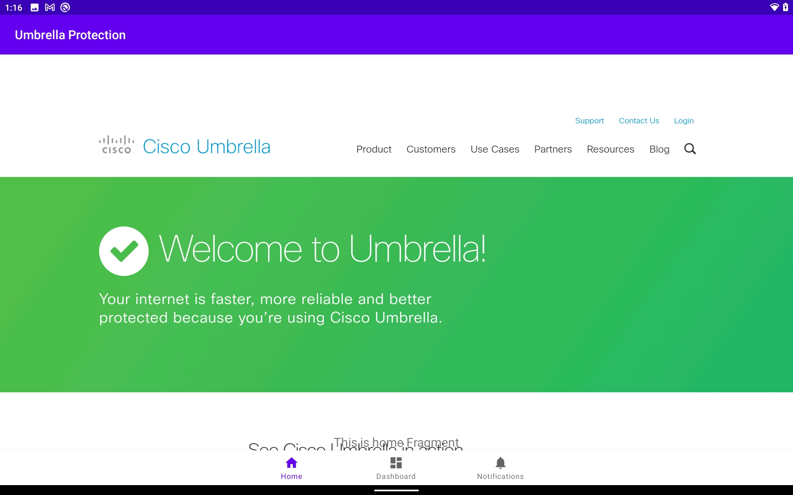
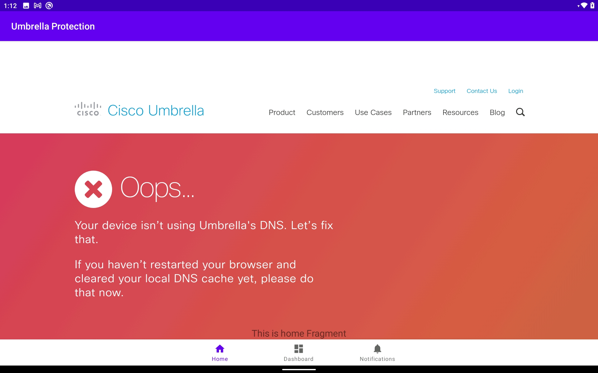
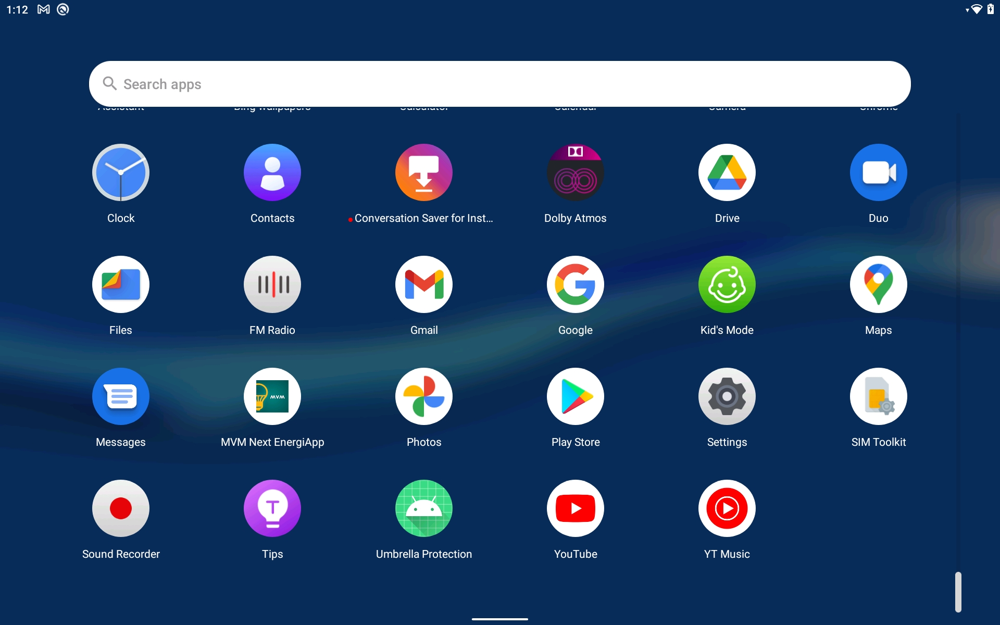

# Umbrella_Protection

This Android APP shows the Umbrella protection status.  

This is the app screen if the device is protected by Umbrella:   

This is the app screen if the device is NOT protected by Umbrella:  

This is the app icon on Android (Umbrella Protection):  

